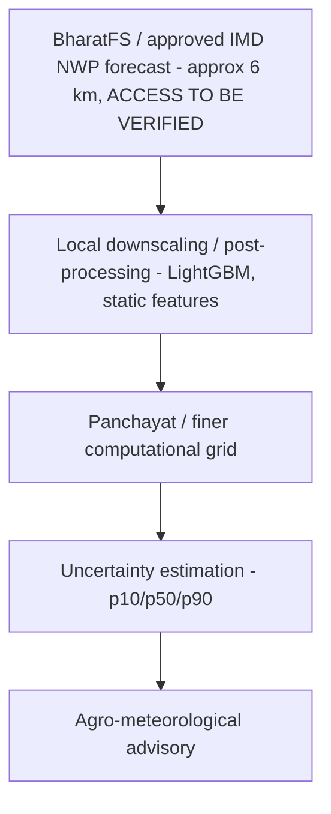
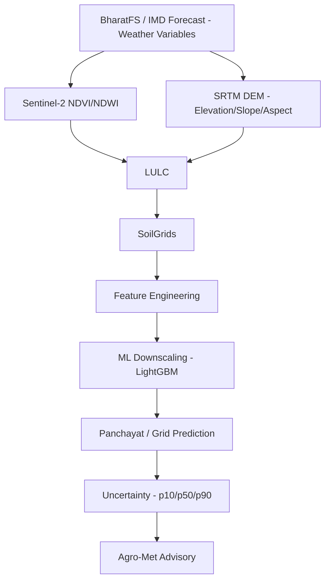
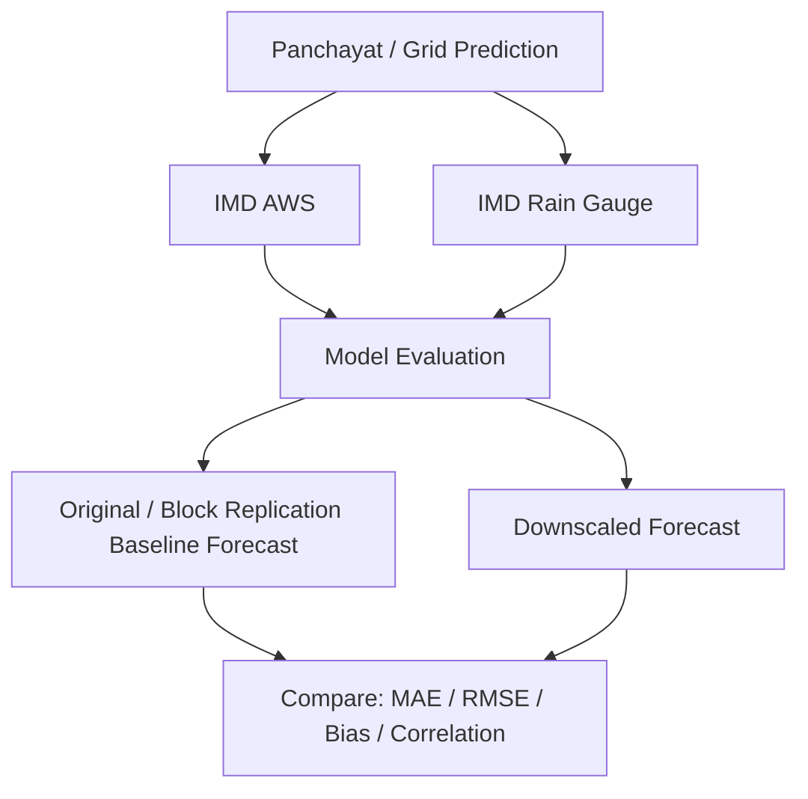

# 03 — Dataset Research & Data Pipeline

## 0. The four data groups, at a glance

Every dataset below falls into exactly one of four groups; keep this grouping in mind since it
also drives the database's `data_source_tag`/`is_synthetic` design (`08_API_AND_DATABASE.md`):

| Group | What it is | Datasets in this file | Used for |
|---|---|---|---|
| **A. Forecast data** | The coarse resolution weather forecast being downscaled — block/cluster-level value, issue time, target date, lead time, variable | §7.1 BharatFS / IMD NWP forecast | `FORECAST`-tagged records; the primary input |
| **B. Ground truth / observations** | Independent local measurements used to validate whether downscaling actually works | §7.2 IMD AWS + rain-gauge network | `OBSERVED`-tagged records; required for real evaluation (never for training features) |
| **C. Historical/contextual data** | Reanalysis/climatology used as supplementary predictors, or as a development-only fallback coarse signal | §7.6 ERA5-Land, §7.10 NASA POWER | Historical training context, or a **fallback-only, non-primary** coarse signal when BharatFS/IMD access is unavailable during development |
| **D. Static geospatial data** | Terrain, land cover, soil, boundaries — the "local high-resolution features" the model conditions on | §7.3 SRTM DEM, §7.4 Sentinel-2 NDVI/NDWI, §7.5 LGD, §7.7 LULC, §7.8 SoilGrids, §7.9 NBSS&LUP | Static/seasonal feature columns per panchayat/grid cell |

> Every dataset below was checked against its own official/authoritative source. Where access,
> resolution, or a value could not be fully confirmed, this is marked **"TBD — requires source
> verification"**, never guessed. Nothing here is fabricated; where the access mechanism for a
> dataset is not confirmed, that gap is stated as **"ACCESS TO BE VERIFIED,"** not papered over.

## 1. Core dataset strategy

The dataset strategy is organised by how load-bearing each source is for the actual
Block/cluster → Panchayat downscaling experiment, not by how easy each one is to fetch.

**CORE (must-have for a scientifically meaningful MVP):**

| # | Dataset | Role |
|---|---|---|
| 1 | **BharatFS / IMD Numerical Weather Prediction** | Primary coarse-resolution forecast input — the signal actually being downscaled |
| 2 | **IMD AWS + IMD rain-gauge observations** | Independent validation ground truth — used to score both the original coarse forecast and the downscaled prediction against reality; never used as just another training feature |
| 3 | **Sentinel-2 surface reflectance (NDVI/NDWI via Google Earth Engine)** | High-resolution vegetation/water static features |
| 4 | **SRTM DEM** | Elevation, slope, aspect static features |
| 5 | **Local Government Directory (LGD)** | District/Block/Gram Panchayat administrative hierarchy and spatial association |

**SUPPORTING (strengthens the model, not required to demonstrate the core experiment):**

| # | Dataset | Role |
|---|---|---|
| 6 | **ERA5-Land** | Historical reanalysis for feature engineering / reference context — **not ground truth** |
| 7 | **Land Use / Land Cover (Bhuvan/NRSC, where accessible)** | Land-cover class static feature |
| 8 | **SoilGrids** | Selected, scientifically relevant soil properties as auxiliary features |

**OPTIONAL / FALLBACK (used only when a CORE/SUPPORTING source is unavailable):**

| # | Dataset | Role |
|---|---|---|
| 9 | **NBSS&LUP soil datasets** | Regional soil-data alternative to SoilGrids where accessible for the pilot state |
| 10 | **NASA POWER** | **Development/fallback dataset only** — never the primary forecast source; noticeably coarser resolution than BharatFS/ERA5-Land (see §7.10) |
| 11 | **Synthetic dataset** | Software/pipeline testing and demonstration only, when real data is unavailable — **never used as evidence of real-world model accuracy** (`11_AGENT_BUILD_PLAN.md` §2.5–2.6) |

## 2. Important current-data correction — do not describe this as "12 km Block forecast → Panchayat"

Earlier framings of this project (and of the PS itself, written when ~12 km experimental grids
were IMD's most advanced operational product) described the pipeline as "12 km IMD Block
forecast → Panchayat forecast." That framing is now out of date and must not be used as the
project's technical description.

As of May 2025, IMD (via IITM Pune, on the Arka supercomputer) has operationalised the
**Bharat Forecast System (BFS)**, an indigenous NWP model running at approximately **6 km
horizontal resolution** across the tropical belt (30°S–30°N) that includes all of India,
replacing the older ~12 km grid referenced in earlier drafts of this documentation. BFS is
described in government/IITM communications as intended to support forecasts down to a
**cluster-of-panchayat / village-level** granularity — i.e. it narrows the Block→Panchayat gap
this PS targets, but a 6 km cell still typically spans multiple panchayats and does not, on its
own, provide panchayat-specific, terrain/land-cover-aware, uncertainty-quantified output.

The corrected conceptual flow for this project is:



**Access status — do not assume this is solved:** one secondary source (a current-affairs
explainer, not an official IMD/IITM/MoES publication) states BFS output is "available to
researchers globally for free," but no official BharatFS/IMD data-access API, endpoint, or
registration process was found and independently confirmed at the time of writing. This project
therefore marks BharatFS data/API access as **ACCESS TO BE VERIFIED** — to be confirmed directly
with IMD/IITM/MoES or SIH organisers before build — and does **not** assume it is automatically
available to a hackathon team. See the fallback chain in §7.1 and §8 if it is not confirmed in
time.

## 3. Dataset classification

| Dataset | Type | Role | Core / Supporting / Fallback |
|---|---|---|---|
| BharatFS / IMD NWP forecast | **FORECAST** | Primary coarse input being downscaled | Core |
| IMD AWS observations | **OBSERVATION** | Independent validation ground truth | Core |
| IMD rain-gauge observations | **OBSERVATION** | Independent validation ground truth (rainfall) | Core |
| Sentinel-2 (NDVI/NDWI) | **SATELLITE** | Vegetation/water static feature | Core |
| SRTM DEM | **GEOSPATIAL** | Elevation/slope/aspect static feature | Core |
| LGD | **ADMINISTRATIVE** | District/Block/Panchayat hierarchy + spatial join key | Core |
| ERA5-Land | **REANALYSIS** | Historical feature engineering / reference context — **not observation** | Supporting |
| Bhuvan/NRSC LULC | **GEOSPATIAL** | Land-cover class static feature | Supporting |
| SoilGrids | **SOIL** | Auxiliary soil static feature | Supporting |
| NBSS&LUP | **SOIL** | Regional soil-data alternative | Fallback |
| NASA POWER | **REANALYSIS/FORECAST-PROXY** | Development-only fallback coarse signal — **never primary** | Fallback |
| Synthetic generator output | **SYNTHETIC** | Pipeline testing/demo only | Fallback |
| Grid-cell / panchayat-aggregated feature values | **DERIVED** | Computed from the GEOSPATIAL/SATELLITE/SOIL sources above, stored per panchayat/grid cell | — (derived, not sourced directly) |

This table exists specifically so that **BharatFS is never confused with an observation**, **IMD
AWS/rain-gauge data is never confused with just another feature column**, and **ERA5-Land /
NASA POWER are never confused with ground truth** — each of those three confusions has appeared
in earlier drafts of this project's documentation and is a scientific-validity risk if repeated.

## 4. Training, Reference and Validation Data

Keeping these four roles distinct is what makes the evaluation in
`07_TECHNICAL_IMPLEMENTATION.md` §4 and `04_ML_DOWNSCALING_APPROACH.md` scientifically
defensible rather than circular:

- **Forecast inputs** (what the model downscales): BharatFS / verified IMD forecast (§7.1); NASA
  POWER only as a development-only substitute when BharatFS/IMD access is unavailable (§7.10).
- **Environmental features** (what the model conditions on): Sentinel-2 NDVI/NDWI (§7.4), SRTM
  DEM-derived elevation/slope/aspect (§7.3), LULC (§7.7), SoilGrids/NBSS&LUP (§7.8–7.9).
- **Historical/reference data** (context, not truth): ERA5-Land (§7.6), used for climatology and
  historical feature engineering where India-specific station history is thin.
- **Ground / independent validation** (what "did it actually work" is measured against): IMD AWS
  and IMD rain-gauge observations (§7.2) — and only these. Model skill is never reported against
  ERA5-Land or NASA POWER as if they were ground truth.
- **Synthetic data** (§7.11): software/pipeline testing only. It demonstrates that the
  engineering pipeline runs end-to-end and that the ML approach can recover a known, by-
  construction spatial signal; it is never cited as evidence that the system forecasts real
  weather accurately (`11_AGENT_BUILD_PLAN.md` §2.5–2.6).

> **ERA5-Land and NASA POWER must not be presented as local observational ground truth**, in any
> document, slide, or evaluation report produced for this project.

## 5. Final recommended data pipeline



**Validation path (independent of the training/inference path above):**



Large rasters (DEM tiles, LULC rasters, Sentinel scenes) are **not** stored inside PostGIS rows;
they are kept in object storage / local file storage as GeoTIFF/COG and only their **derived,
per-panchayat/per-grid-cell scalar values** are written to the database (see storage strategy in
`05_SYSTEM_ARCHITECTURE.md`).

## 6. Corrections to earlier claims (do not repeat these)

- NASA POWER is **not** the main weather forecast source for this project — it is a
  development/fallback dataset only, clearly coarser (~55 km) than both BharatFS (~6 km) and
  ERA5-Land (~9–11 km) (§7.10).
- ERA5-Land is a **reanalysis**, not ground truth — it is historical model output blended with
  assimilated observations, not an independent local measurement (§7.6).
- Synthetic data **proves the pipeline runs and that the ML approach can recover a known,
  by-construction signal** — it does **not** prove real-world forecasting accuracy
  (`11_AGENT_BUILD_PLAN.md` §2.5–2.6).
- The 1 km grid referenced elsewhere in this documentation is **"the proposed computational
  grid resolution for the prototype, not a guaranteed observational or forecast accuracy
  level"** (`07_TECHNICAL_IMPLEMENTATION.md` §2) — it must never be described as "1 km accurate
  weather forecast."
- Not every panchayat has an AWS station — station density is sparse nationally (§7.2); this is
  a stated limitation, not something the documentation should imply is solved.
- BharatFS data/API access is **not** assumed automatically available to this project — see §2.
- No dataset's resolution, access method, or coverage is stated here unless it was checked
  against its own source; anything not confirmed is marked **"TBD — requires source
  verification."**

## 7. Dataset details

### 7.1 BharatFS / IMD Numerical Weather Prediction — CORE, the input the PS is about

| Field | Detail |
|---|---|
| Dataset name | Bharat Forecast System (BFS), and/or IMD's operational block/cluster-level forecast product built on it (Meghdoot / Gramin Krishi Mausam Sewa dissemination layer) |
| Provider | India Meteorological Department (IMD) / Ministry of Earth Sciences (MoES); model developed by the Indian Institute of Tropical Meteorology (IITM), Pune, run on the Arka supercomputer |
| Data type | FORECAST |
| Spatial resolution | ~6 km × 6 km (BFS, operational since 26 May 2025), replacing the earlier ~12 km grid this project's earlier drafts referenced; covers the tropical belt 30°S–30°N, i.e. all of India |
| Temporal resolution | Daily forecast cycle; multi-day horizon. Exact published horizon length for BFS specifically: **TBD — requires source verification** |
| Historical coverage | BFS has been under experimental testing since the early 2020s and became operational in May 2025; a long, publicly documented historical archive for third-party retrieval was not confirmed — **TBD — requires source verification** |
| Variables | Temperature, rainfall, humidity, wind — exact variable list exposed via any public feed: **TBD — requires source verification**; do not assume a variable is available until confirmed |
| Forecast/observation/reanalysis status | FORECAST (NWP model output, increasingly blended with AI/ML post-processing per IMD/IITM communications) |
| Access method | **ACCESS TO BE VERIFIED.** No officially confirmed public API/registration process for BharatFS or the underlying block/cluster forecast feed was found and independently verified at the time of writing (see §2). The Meghdoot mobile app disseminates block-level forecasts/advisories to end users but is not documented as a programmatic data API; a separate `api.imd.gov.in` portal exists but its data contract for this specific product/third-party hackathon use is unconfirmed. |
| Expected role | Primary coarse-forecast input (`coarse_*` feature columns); the signal this entire project downscales |
| Limitations | Access mechanism unverified (§2); even at 6 km, a single BFS cell still typically spans multiple panchayats, so downscaling remains necessary, not redundant |
| Required for MVP | **Yes** — with the explicit fallback below if access cannot be confirmed in time |

**Fallback if BharatFS/IMD access cannot be confirmed in time:** use ERA5-Land (§7.6) as a
higher-quality proxy coarse signal, or NASA POWER (§7.10) as a lighter-weight development-only
proxy, and clearly label the demo as using a *proxy* coarse source where IMD's/BFS's own feed is
not available to the team. Neither substitute is presented as BharatFS/IMD data.

### 7.2 IMD AWS + IMD Rain Gauge observations — CORE, VALIDATION ONLY

| Field | Detail |
|---|---|
| Dataset name | IMD Automatic Weather Station (AWS) network; IMD rain-gauge network |
| Provider | India Meteorological Department |
| Data type | OBSERVATION |
| Spatial resolution | Point stations; network found to include **~1,019 stations covering 732 districts** feeding nowcast warnings — sparse relative to ~250,000+ gram panchayats nationally |
| Temporal resolution | Sub-daily/daily |
| Historical coverage | Ongoing operational network; historical archive length for third-party retrieval: **TBD — requires source verification** |
| Variables | Temperature, rainfall, humidity, wind (station-dependent) |
| Forecast/observation/reanalysis status | **OBSERVATION** — independent ground truth |
| Access method | IMD data-supply channel; exact process for this project's pilot district: **TBD — requires source verification, TODO before build** |
| Expected role | **Validation only** — used to independently score (a) the original/coarse BharatFS-or-fallback forecast and (b) the downscaled panchayat-level prediction against reality. Never used as a training feature disguised as an input. |
| Limitations | Sparse relative to panchayat count — the single biggest scientific constraint on this project (see `10_TESTING_DEPLOYMENT_AND_PPT.md` §7 Limitations); not every panchayat has an AWS station |
| Required for MVP | **Yes** — without independent observations, "does downscaling help" cannot be scientifically claimed, only assumed |

### 7.3 SRTM Digital Elevation Model — CORE (static feature)

| Field | Detail |
|---|---|
| Dataset name | SRTM DEM (and/or Bhoonidhi/NRSC DEM products) |
| Provider | USGS/NASA (SRTM, global, 30 m); NRSC/ISRO also produces Indian DEM products (finer-than-30 m gated to government entities via Bhoonidhi) |
| Data type | GEOSPATIAL |
| Spatial resolution | 30 m (SRTM, open); NRSC finer-than-30 m: government-entity access only |
| Temporal resolution | Static |
| Variables derived | Elevation, slope, aspect (computed via GIS from the raw DEM) |
| Forecast/observation/reanalysis status | N/A (static terrain) |
| Access method | Freely available (USGS EarthExplorer; Google Earth Engine `USGS/SRTMGL1_003`) |
| License | Public domain (SRTM) |
| Expected role | Elevation/slope/aspect static features per panchayat/grid cell |
| Limitations | 30 m is coarser than Sentinel-2's 10 m; fine for terrain gradients at panchayat scale |
| Required for MVP | **Yes** |

### 7.4 Sentinel-2 derived NDVI/NDWI — CORE (satellite-derived static/seasonal feature)

| Field | Detail |
|---|---|
| Dataset name | Sentinel-2 Surface Reflectance, NDVI/NDWI derived |
| Provider | ESA Copernicus (raw imagery); processed on-demand via **Google Earth Engine** (preferred) |
| Data type | SATELLITE (derived: DERIVED) |
| Spatial resolution | 10 m |
| Temporal resolution | ~5-day revisit; cloud cover reduces effective usable frequency to roughly every 1–2 weeks |
| Variables derived | NDVI (vegetation density), NDWI (surface water); other indices only if a specific agronomic justification is documented — none are added speculatively |
| Access method | Free via a Google Earth Engine account (`COPERNICUS/S2_SR_HARMONIZED` collection); no cost, generous non-commercial research/education quota |
| License | Copernicus open data terms |
| Expected role | Vegetation-density and surface-water static/seasonal features |
| Limitations | Not daily in practice once cloud-filtered; effective refresh ~1–2 weeks |
| Required for MVP | **Yes** |

### 7.5 Local Government Directory (LGD) — CORE (administrative)

| Field | Detail |
|---|---|
| Dataset name | Local Government Directory (LGD), Ministry of Panchayati Raj |
| Provider | Ministry of Panchayati Raj, Government of India |
| Data type | ADMINISTRATIVE |
| What it actually provides | Authoritative **codes and hierarchy** (State → District → Block → Gram Panchayat → Village), with periodic updates for new/merged/split panchayats, since 2007 |
| What it does **not** reliably provide | A single, nationwide, ready-to-use **panchayat polygon (GIS boundary)** layer — boundary digitisation is fragmented across states (Bhuvan Panchayat covers only some states, e.g. Karnataka; other states run separate GIS portals; Census village boundaries are a common substitute) |
| Access method | `lgdirectory.gov.in`, mirrored on `data.gov.in`; district/state boundary WFS via `nsdiindia.gov.in` |
| License | Government of India open data terms (verify per-state for boundary layers) |
| Expected role | District/Block/Gram Panchayat hierarchy and the spatial-join key tying every other dataset to an administrative unit |
| Limitations | Panchayat-polygon availability must be checked per pilot state/district before committing to it — see `07_TECHNICAL_IMPLEMENTATION.md` §2 for the grid-first fallback when polygons are unavailable. **Real boundary files from state GIS portals/Bhuvan are not guaranteed to key on the LGD code at all** — many state portals use their own internal ID scheme, and even where an LGD-like field exists, name/code drift (renamed, merged, or split panchayats over time) means a naive `code == code` join will silently drop or mis-map rows rather than erroring loudly. Phase-2 reconciliation step (required before any real-boundary polygon is trusted): (1) exact match on LGD code where present; (2) for unmatched rows, fuzzy-match on normalised panchayat name **within the same block** (e.g. `rapidfuzz`, threshold tuned empirically, block-scoped to avoid cross-district false matches) plus a centroid-distance sanity check against any known reference point; (3) anything still unmatched is written to a `boundary_reconciliation_review.csv` for manual resolution — **never auto-joined on a low-confidence guess**. This reconciliation step is itself unit-tested against a small fixture with known renames/splits before being trusted on real data. |
| Required for MVP | **Yes** |

### 7.6 ERA5-Land — SUPPORTING (reanalysis, not ground truth)

| Field | Detail |
|---|---|
| Dataset name | ERA5-Land |
| Provider | ECMWF / Copernicus Climate Change Service (C3S), via Copernicus Climate Data Store (CDS) |
| Data type | **REANALYSIS — not OBSERVATION, not FORECAST** |
| Spatial resolution | Native ~9 km; distributed on a regular 0.1° × 0.1° (~11 km) lat/lon grid |
| Temporal resolution | Hourly (also monthly-mean and daily-statistics products) |
| Historical coverage | 1950 to ~5 days before present |
| Variables | 2 m temperature, dewpoint, precipitation, wind components, soil moisture/temperature layers, radiation, and more |
| Forecast/observation/reanalysis status | Reanalysis (model + assimilated observations) — a high-quality **model reconstruction**, explicitly **not** an independent local observation and **not** presented as ground truth anywhere in this project |
| Access method | Free registration on the Copernicus CDS; API (`cdsapi` Python client) |
| License | Copernicus open license (attribution required) |
| Expected role | Historical training context/features where India-specific station history is thin; development-only fallback coarse signal if BharatFS/IMD access is unavailable (§7.1) |
| Limitations | Not a substitute for either the actual forecast being downscaled or for ground-truth validation |
| Required for MVP | Supporting — useful, not required to demonstrate the core experiment |

### 7.7 Land Use / Land Cover (Bhuvan/NRSC preferred) — SUPPORTING

| Field | Detail |
|---|---|
| Dataset name | Bhuvan/NRSC Land Use Land Cover (LULC) |
| Provider | National Remote Sensing Centre (NRSC), ISRO |
| Data type | GEOSPATIAL |
| Products found | LULC 1:50,000 (LISS-III, 2005-06 / 2011-12 / 2015-16), LULC 1:250,000 (AWiFS, annual 2004-05 to 2018-19), Urban LU 1:10,000 |
| Spatial resolution | ~56 m (AWiFS-derived) to finer (~24 m, LISS-III-based) depending on product |
| Access method | Bhuvan Thematic Services / "clip & ship" after free account registration; MOU/purpose declaration required for some products — **not a zero-friction open API** |
| License | ISRO/NRSC terms; attribution as "BHOOSAMPADA, NRSC (ISRO)" required for some products |
| Expected role | Land-cover class static feature per grid cell/panchayat |
| Limitations | Registration/MOU friction; product vintage may lag current land use in fast-changing peri-urban areas |
| Required for MVP | Supporting |

### 7.8 SoilGrids — SUPPORTING

| Field | Detail |
|---|---|
| Dataset name | SoilGrids (ISRIC, global) |
| Provider | ISRIC — World Soil Information |
| Data type | SOIL |
| Spatial resolution | 250 m global |
| Access method | Fully open REST API / WCS, no registration |
| License | Open (CC-BY, per ISRIC terms) |
| Expected role | Only **selected, scientifically relevant** soil variables (e.g. texture class) used as auxiliary static features — not the full ISRIC variable stack added speculatively |
| Limitations | Global product, coarser and less locally calibrated than a verified state soil survey |
| Required for MVP | Supporting |

### 7.9 NBSS&LUP soil datasets — OPTIONAL / FALLBACK

| Field | Detail |
|---|---|
| Dataset name | National Bureau of Soil Survey & Land Use Planning (NBSS&LUP) state soil maps |
| Provider | NBSS&LUP / state agriculture departments |
| Data type | SOIL |
| Spatial resolution | Varies by state, typically coarser published scale than SoilGrids' 250 m grid |
| Access method | State agriculture department portals — access varies; **TBD — requires source verification per pilot state** |
| Expected role | Regional soil-data alternative to SoilGrids, used only where accessible and locally more accurate for the chosen pilot state |
| Required for MVP | Optional/Fallback |

### 7.10 NASA POWER — OPTIONAL / FALLBACK ONLY

| Field | Detail |
|---|---|
| Dataset name | NASA POWER |
| Provider | NASA Langley Research Center (LaRC), Earth Science Directorate |
| Data type | REANALYSIS/MODEL (with a dedicated agroclimatology "AG" parameter set) |
| Spatial resolution | 0.5° × 0.625° (~50–60 km) — **noticeably coarser than both BharatFS (~6 km) and ERA5-Land (~9–11 km)** |
| Temporal resolution | Daily, monthly, hourly, climatology |
| Access method | Free public REST API, no authentication required |
| License | Public domain / free use |
| Expected role | **Development/fallback dataset only.** Useful for a zero-friction, dependency-free pipeline smoke-test during early development, and for loosely cross-checking other coarse values — **must never be used, described, or presented as the project's primary forecast source**, given its coarse resolution relative to every alternative in §7.1/§7.6 |
| Required for MVP | Fallback only |

### 7.11 Synthetic dataset — FALLBACK, SOFTWARE TESTING ONLY

| Field | Detail |
|---|---|
| Dataset name | Project-generated synthetic data (`ml/synthetic/generate.py`, see `11_AGENT_BUILD_PLAN.md` §2) |
| Provider | This project (seeded, deterministic generator) |
| Data type | SYNTHETIC |
| Expected role | Lets the full pipeline (ingestion → features → training → API → dashboard) run and be demoed with zero external dependencies, and lets the ML approach be checked against a known, by-construction spatial signal (`11_AGENT_BUILD_PLAN.md` §2.6, "scientific acceptance (synthetic only)") |
| Limitations | **Never used as evidence of real-world forecasting accuracy.** Every synthetic record is tagged `is_synthetic: true`, and any dashboard/demo running on it displays a persistent "synthetic demonstration data" banner (`11_AGENT_BUILD_PLAN.md` §1) |
| Required for MVP | Fallback — used only when a real CORE/SUPPORTING dataset above is not accessible in time |

## 8. Minimum Viable Dataset Stack

Start the MVP with the smallest reliable feature set, and add datasets only after measuring
whether they actually improve model skill on the spatial-holdout evaluation
(`07_TECHNICAL_IMPLEMENTATION.md` §4) — not by default.

**MVP core stack:**
1. BharatFS / IMD forecast (§7.1) — or its documented fallback (ERA5-Land, then NASA POWER) if
   access is not confirmed in time.
2. IMD AWS / rain-gauge observations (§7.2) — validation only.
3. LGD panchayat boundaries (§7.5) — or the synthetic/grid fallback if boundaries are
   unavailable for the pilot district (`07_TECHNICAL_IMPLEMENTATION.md` §2).
4. SRTM DEM (§7.3).
5. Sentinel-2 NDVI/NDWI (§7.4).

**Optional (add only if they measurably improve validated skill):** LULC (§7.7), ERA5-Land as a
feature source (§7.6), SoilGrids (§7.8).

**Fallback (development convenience, never the reported "real" result):** NASA POWER (§7.10),
synthetic data (§7.11).

## 9. Feature table (proposed)

| Feature | Source | Type | Role |
|---|---|---|---|
| Forecast temperature (max/min) | BharatFS/IMD (§7.1) | FORECAST | Input |
| Forecast rainfall | BharatFS/IMD (§7.1) | FORECAST | Input |
| Forecast humidity | BharatFS/IMD (§7.1) | FORECAST | Input (only if confirmed available, §7.1) |
| Forecast wind | BharatFS/IMD (§7.1) | FORECAST | Input (only if confirmed available, §7.1) |
| Elevation | SRTM (§7.3) | GEOSPATIAL | Feature |
| Slope | SRTM (§7.3) | DERIVED | Feature |
| Aspect | SRTM (§7.3) | DERIVED | Feature |
| NDVI | Sentinel-2 (§7.4) | SATELLITE/DERIVED | Feature |
| NDWI | Sentinel-2 (§7.4) | SATELLITE/DERIVED | Feature |
| Land cover class | LULC (§7.7) | GEOSPATIAL | Feature (Supporting) |
| Soil texture/class | SoilGrids / NBSS&LUP (§7.8–7.9) | SOIL | Feature (Supporting) |
| Observed weather (temp/rainfall/humidity) | IMD AWS / rain gauge (§7.2) | OBSERVATION | **Validation only — never a training feature** |
| Historical climatology | ERA5-Land (§7.6) | REANALYSIS | Supporting context feature |

Weather-variable rows (temperature, rainfall, humidity, wind) are only wired into the actual
feature-engineering code **after** their availability from the selected forecast source is
verified — this table lists what is proposed, not what is confirmed present in every feed.

## 10. Scientific validation

The purpose of the downscaling model is not merely to produce a visually higher-resolution
weather map. Its scientific value must be demonstrated by comparing its predictions against
**independent observations** and against the **original/coarse forecast baseline** —
specifically the mandatory **Block Replication Baseline** (`04_ML_DOWNSCALING_APPROACH.md` §0),
not a strawman.

```text
Original / Block Replication Baseline Forecast
                vs
        Downscaled Forecast
                vs
      Independent Observations (IMD AWS / rain gauge)
```

Metrics: MAE, RMSE, Bias, Correlation (R/R²), with precipitation-specific metrics (rain-
occurrence precision/recall/F1) added where appropriate for rainfall
(`07_TECHNICAL_IMPLEMENTATION.md` §4). No accuracy number is fabricated, assumed, or reported
before the model is actually trained and evaluated (`04_ML_DOWNSCALING_APPROACH.md` §6).

## 11. Data ingestion pipeline

```
[BharatFS/IMD forecast feed]   [ERA5-Land / NASA POWER - fallback only]   [Static: DEM, Sentinel-2, LULC, soil, LGD]
        |                              |                                |
        v                              v                                v
  Raw landing zone (object storage / local data lake, partitioned by date+source)
                              |
                              v
                 Schema & quality validation
        (range checks, missing-value flags, unit normalisation, timezone to IST)
                              |
                              v
                  Spatial alignment (reproject to common CRS, join to block/panchayat/grid via GeoPandas spatial join)
                              |
                              v
                 Temporal alignment (align forecast issue-time & horizon; align static features' validity period)
                              |
                              v
                       Feature store (PostgreSQL/PostGIS for tabular+vector, Parquet/GeoParquet for bulk raster-derived tables)
                              |
                              v
                 Downstream: ML training set  /  ML inference feature vector
```

## 11.5 Storage growth, partitioning and retention (relevant once real daily data replaces synthetic)

The 2-year synthetic pilot dataset is small (a few thousand grid cells × 2 years of daily
records is on the order of low millions of rows) and needs no special handling. This does
**not** hold once the pipeline is pointed at real daily-cadence data (FR-1: daily block
forecasts; real AWS/rain-gauge observations), so the following is documented now as a
Phase-2/production requirement, not built for the MVP:

- `weather_observation` and `weather_forecast` are partitioned by month (Postgres native
  declarative partitioning on `timestamp`/`forecast_date`) once real ingestion begins — this
  keeps indexes small and makes retention a cheap `DROP PARTITION` instead of a row-by-row
  `DELETE`.
- Retention policy (Phase-2 default, tunable): keep raw daily records for **24 months**, then
  roll up to monthly aggregates (mean/min/max per variable per location) for anything older,
  discarding the raw rows. `MLPrediction`/`BaselinePrediction` history is kept longer (they're
  small relative to observations) since they're needed for drift monitoring (`10` §1).
- `environmental_feature` (DEM/LULC/soil/NDVI) is naturally low-churn (periodic, not daily —
  FR-2) and is versioned by `valid_from`/`valid_to` rather than partitioned; old versions are
  kept indefinitely since the table stays small even over many years.
- None of this blocks the MVP: the synthetic 2-year dataset is well within an unpartitioned
  table's comfortable range, and this section exists so a team continuing past the hackathon
  doesn't discover unbounded growth as a surprise in production.

## 12. Sources consulted (for traceability)

- BharatFS: IITM/MoES launch coverage (26 May 2025) reporting the 6 km resolution, IITM
  development, Arka supercomputer, and replacement of the ~12 km grid; one secondary
  current-affairs explainer's claim of free global researcher access was noted but **not**
  treated as a confirmed official access mechanism (§2).
- IMD block/agromet program: IMD press release on Meghdoot (Aug 2022); IMD block-level monsoon
  forecast coverage reporting; `api.imd.gov.in` portal.
- ERA5-Land: Copernicus CDS dataset pages (`reanalysis-era5-land-monthly-means`,
  `reanalysis-era5-land-timeseries`), ECMWF `era5-land` product page.
- NASA POWER: `power.larc.nasa.gov`, `nasapower`/`pynasapower` client documentation.
- Bhuvan/NRSC: Bhoonidhi Brochure 2025 (NRSC/ISRO), Bhuvan Geospatial Content document, Bhuvan
  thematic-services update pages.
- LGD / panchayat boundaries: Ministry of Panchayati Raj LGD background, `indian_village_boundaries`
  community index of state-wise boundary sources, ESRI India admin-boundary-demographics brief,
  OpenStreetMap wiki "Open Geospatial Data from Government of India."

## 13. TODO before build

- [ ] Confirm the official BharatFS/IMD data-access mechanism (API, registration, or data-supply
      request) directly with IMD/IITM/MoES or SIH organisers — do not assume the free-access
      claim in one secondary source (§2) without official confirmation.
- [ ] Confirm with SIH organisers / IMD contact whether a specific dataset link/API key will be
      provided for PS 26074 (the official portal's "Dataset Link" field was blank as viewed).
- [ ] Pick the pilot district only **after** confirming panchayat-boundary availability for
      candidate states (start with Karnataka, given the Bhuvan Panchayat product found there).
- [ ] Confirm IMD AWS/rain-gauge data-supply process for validation-grade ground truth in the
      chosen pilot district.
- [ ] Confirm the exact forecast variable list and horizon actually exposed by whichever
      BharatFS/IMD feed is ultimately used (§7.1) before wiring `coarse_*` feature columns to it.
- [ ] Before trusting any real (non-Bhuvan-Karnataka) state boundary file: run the LGD
      reconciliation step (§7.5) and manually clear anything routed to
      `boundary_reconciliation_review.csv` — do not merge unresolved rows.
- [ ] Provision a Google Earth Engine **service account** (not a personal OAuth login) and set
      `GOOGLE_APPLICATION_CREDENTIALS` before switching `FEATURE_PROVIDER` from `synthetic` to
      `gee` (`11_AGENT_BUILD_PLAN.md` §3.2); confirm the Community Tier's 150 EECU-hour/month
      quota is sufficient for the pilot district's feature refresh cadence (§7.4).
