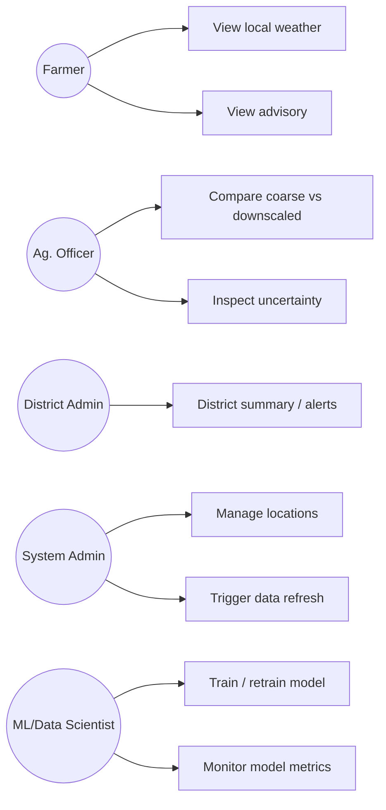

# 06 — Workflows & Use Cases

## 1. Actors

| Actor | Description |
|---|---|
| Farmer | Views local forecast/advisory for their panchayat |
| Agricultural Officer | Views block/panchayat forecasts, advisory, and `uncertainty_label`/interval to guide field visits |
| Block/Panchayat Officer | Views local data for administrative planning |
| District Administration | Views district-wide summary, extreme-weather alerts |
| IMD/Meteorological Data Provider | External source of coarse forecast (system does not act on their behalf, only consumes) |
| System Administrator | Manages locations, data sources, monitors ingestion/model health |
| ML/Data Scientist | Trains/validates/retrains models, inspects metrics |

Actors *not* included (deliberately, to avoid an over-built prototype): payment/billing roles,
external developer/API-key self-service portal (assumed manual for pilot), social/community
features.

## 2. Use cases

| Use case | Primary actor | Notes |
|---|---|---|
| View local (panchayat) weather | Farmer | Default landing view after selecting location |
| View Panchayat forecast (multi-day) | Farmer, Ag. Officer | Time-series chart |
| View high-resolution map | All | Toggle coarse vs. downscaled layer |
| Check rainfall prediction | Farmer | With `uncertainty_label` shown |
| Check heat-stress risk | Farmer, Ag. Officer | Advisory-engine output |
| Receive agro-advisory | Farmer | Requires crop + stage input |
| Compare coarse vs. downscaled forecast | Ag. Officer, District Admin | Core USP demo use case |
| Inspect prediction uncertainty | Ag. Officer, ML/Data Scientist | Uncertainty layer |
| Manage locations (add district/block/panchayat) | System Admin | Scaling use case |
| Upload/refresh datasets | System Admin, ML/Data Scientist | Triggers ingestion pipeline |
| Train/retrain model | ML/Data Scientist | Authenticated; produces a new `ModelVersion` |
| Monitor model performance | ML/Data Scientist, System Admin | `/model/metrics` |
| Generate district report | District Administration | Export summary |

## 3. Use-case diagram (Mermaid)

## 4. Workflows

### A. Data ingestion (daily)
Scheduled job pulls coarse forecast (IMD or fallback source) → lands raw file → schema
validation → spatial/temporal alignment → written to PostGIS/Parquet feature store.

### B. Baseline and model inference (daily, after ingestion)
New block forecast + current static features → feature vector per panchayat/grid cell. Two
things run in parallel on the same input: (1) the **Baseline Module** copies the block forecast
to every panchayat (Block Replication Baseline, plus optional secondary IDW where applicable)
and writes to `BaselinePrediction`, tagged `BASELINE`; (2) the loaded ML model scores the point +
quantile interval and writes to `MLPrediction` / `PredictionUncertainty`, tagged `ML_DOWNSCALED`.
Every panchayat/date/variable therefore always has both a baseline and an ML value to compare.

### C. Advisory generation (after inference)
Advisory engine reads latest predictions + registered crop/stage/soil context per panchayat →
evaluates threshold rules → writes `Advisory` records with an `uncertainty_label`-derived flag
(e.g. advisories are downgraded to "informational only" when prediction `uncertainty_label` is
low).

### D. Dashboard visualization (on demand)
User selects District → Block → Panchayat (or grid cell) → frontend calls
`/prediction/{location_id}` and `/advisory` → renders map layers + charts + advisory panel,
each element tagged with its data-provenance badge (OBSERVED/FORECAST/BASELINE/ML_DOWNSCALED)
and, where relevant, a synthetic-data indicator (`is_synthetic`).

### E. Model retraining (periodic, manual-triggered for MVP)
ML engineer triggers retrain with an updated historical window → pipeline re-runs Phases in
`07_TECHNICAL_IMPLEMENTATION.md` §training strategy → new model compared against current
production model on the same held-out spatial split → promoted only if it does not regress key
metrics.

### F. Error/drift monitoring
Scheduled job compares recent downscaled predictions against newly arrived ground observations
(where available) and flags growing error/drift for review — this is a **monitoring signal for
humans**, not an automatic silent retrain, given the prototype's limited validation data.
