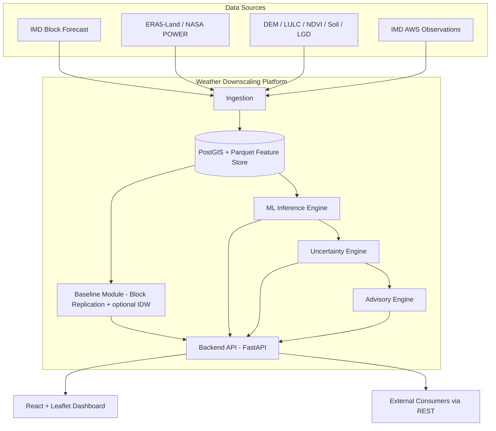
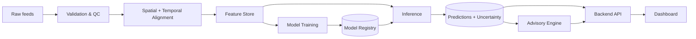
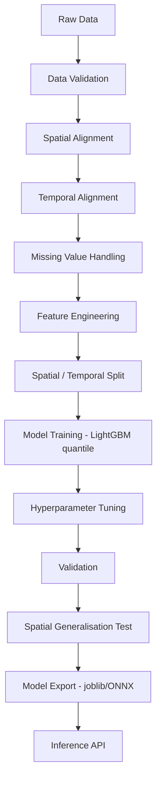
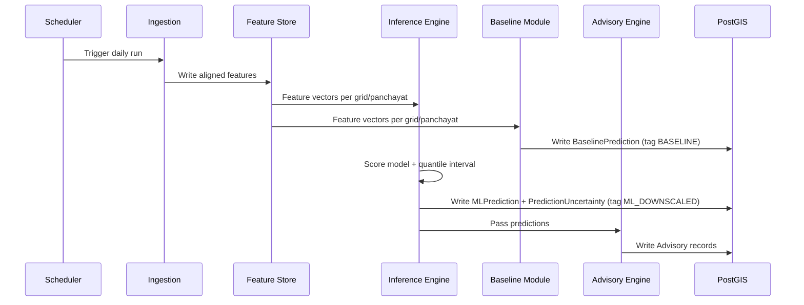
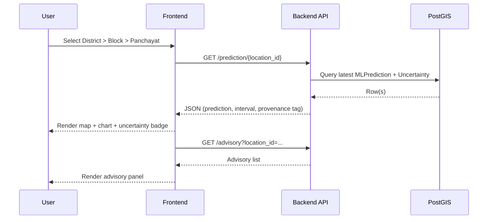
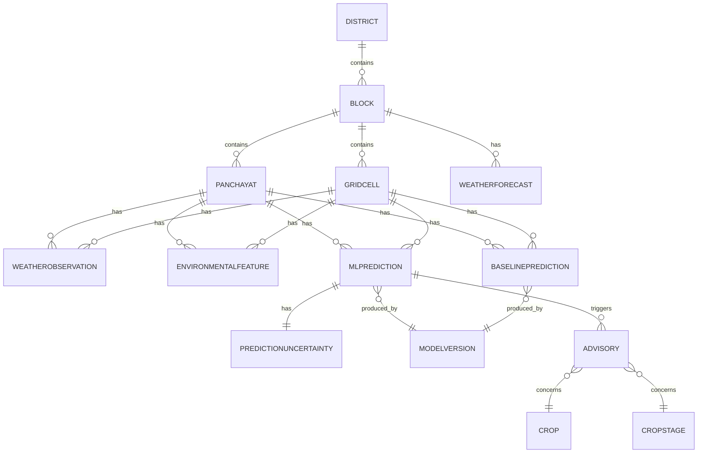
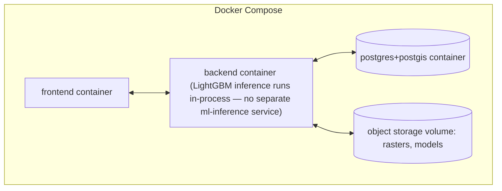
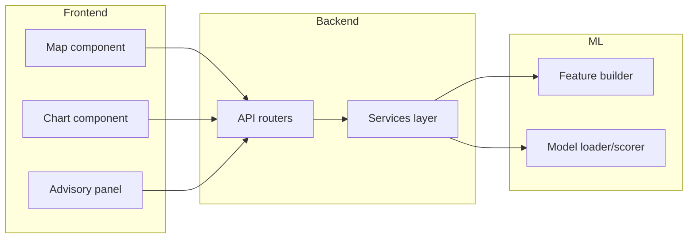
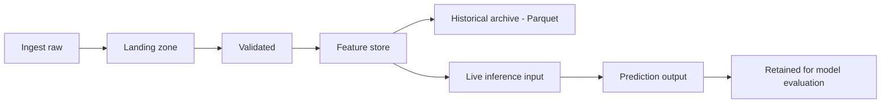
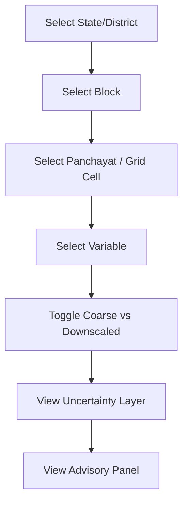

# 09 — Diagrams

## 1. High-level system architecture

Note: the Baseline Module (`B2a`) runs in parallel with the ML Inference Engine (`B3`) on the
same feature store, not downstream of it — both feed the API so every panchayat record carries
a baseline value and an ML value side by side (§0 of `04_ML_DOWNSCALING_APPROACH.md`).

## 2. Data flow diagram

## 3. ML pipeline (training)

## 4. Inference pipeline (runtime)

## 5. Use-case diagram

See `06_WORKFLOW_AND_USE_CASES.md` §3.

## 6. Sequence diagram — dashboard request

## 7. ER diagram

## 8. Deployment diagram

## 9. Component diagram

## 10. Data lifecycle

## 11. Dashboard flow

